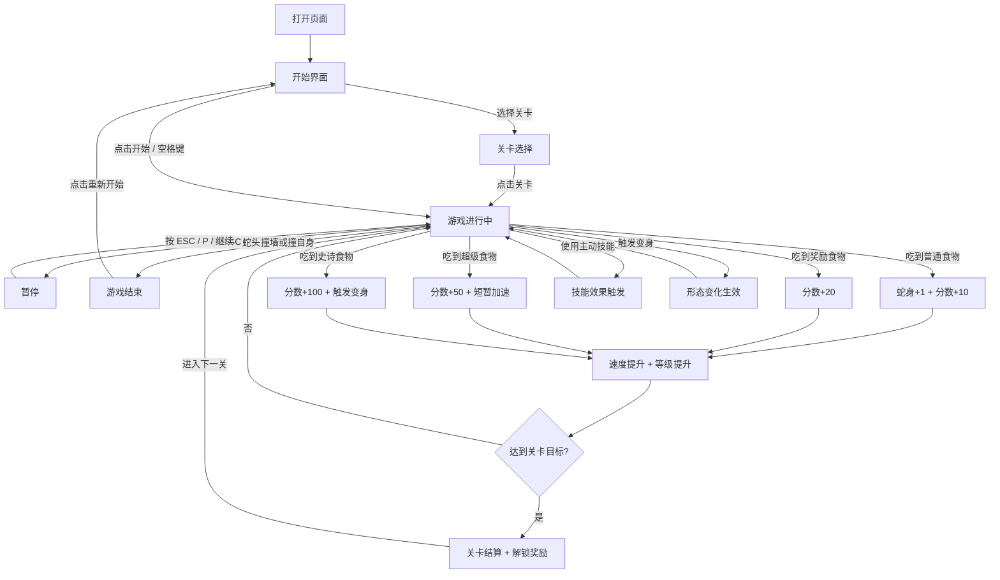

## 1. 产品概述

网页版贪吃蛇游戏——一款以霓虹赛博朋克风格打造的经典街机游戏，玩家操控光蛇在数字矩阵中穿行、吞噬能量粒子不断成长，追求最高分数。在经典玩法基础上，引入**难度控制、多关卡、变异变身、技能道具**四大进阶系统，让游戏体验从简单休闲升级为富有策略深度的挑战。

- 面向所有喜欢休闲小游戏的用户，提供即开即玩的流畅体验
- 以视觉冲击力和操作手感为核心竞争力，让经典玩法焕发新生
- 通过渐进式难度与丰富技能组合，满足从新手到硬核玩家的多层次需求

## 2. 核心功能

### 2.1 功能模块

1. **游戏主页面**：游戏画布、分数面板、操作控制、游戏状态管理
2. **关卡系统**：多关卡配置、关卡目标、关卡解锁、关卡类型切换
3. **难度控制系统**：渐进式参数调节、动态难度平衡（DDA）、危险区域机制
4. **变异变身系统**：食物驱动形态变化、主动变身机制
5. **技能道具系统**：被动技能、主动技能、技能充能与组合策略
6. **排行榜弹窗**：本地历史最高分记录展示
7. **存档与进度系统**：关卡进度存档、解锁皮肤与技能、成就记录

### 2.2 页面详情

| 页面名称 | 模块名称 | 功能描述 |
|----------|----------|----------|
| 游戏主页面 | 游戏画布 | Canvas 渲染蛇身、食物、网格背景、障碍物、危险区域，蛇身带霓虹发光拖尾效果 |
| 游戏主页面 | 分数面板 | 实时显示当前分数、最高分、当前等级、关卡目标进度 |
| 游戏主页面 | 操作控制 | 键盘方向键/WASD 控制 + 移动端虚拟方向键 + 技能快捷键 |
| 游戏主页面 | 游戏状态 | 开始界面、游戏中、暂停、游戏结束四种状态切换 |
| 游戏主页面 | 速度等级 | 随分数增长自动加速，显示当前速度等级 |
| 游戏主页面 | 技能栏 | 显示当前拥有的被动/主动技能图标、充能进度、快捷键提示 |
| 游戏主页面 | 变身指示 | 当前变身状态图标、剩余时间/次数 |
| 游戏主页面 | 关卡信息 | 当前关卡编号、目标分数、已解锁内容 |
| 关卡选择页 | 关卡列表 | 展示所有关卡卡片，已解锁/未解锁状态，点击进入 |
| 排行榜弹窗 | 历史记录 | 展示本地存储的 Top 10 最高分记录，含日期和分数 |
| 存档面板 | 进度管理 | 展示已解锁关卡、皮肤、技能，支持存档重置 |

## 3. 核心流程

玩家打开页面后看到霓虹风格的开始界面，可选择关卡或直接开始游戏。蛇以恒定速度向当前方向移动，玩家通过方向键/WASD 改变蛇的行进方向。蛇头触碰到食物后蛇身增长、分数增加，同时生成新食物。不同食物触发不同效果（加分、变身、技能充能等）。当蛇头撞到墙壁、障碍物或自身时游戏结束（护盾可免疫一次），弹出结算面板显示本局分数与最高分，可选择重新开始。达到关卡目标分数后进入下一关，解锁新内容。

## 4. 难度控制系统

### 4.1 渐进式参数调节

| 维度 | 具体手段 | 效果 |
|------|----------|------|
| **移动速度** | 每关/每100分提升10%-20% | 压缩反应时间，增加紧张感 |
| **目标分数** | 关卡1: 200分 → 关卡5: 1500分 | 延长单局时长，提供成长感 |
| **食物刷新** | 普通食物间隔缩短，特殊食物出现频率降低 | 迫使玩家在风险与收益间抉择 |
| **地图边界** | 从"穿墙模式"逐步变为"硬边界" | 后期完全限制走位空间 |

### 4.2 动态难度平衡（DDA）

- **连击奖励机制**：连续快速吃食物可获得分数加成，但失误后重置
- **自适应速度**：根据玩家最近30秒的表现动态微调速度（表现好则加速，表现差则略降）
- **危险区域机制**：蛇身经过的路径会留下临时危险区（红色标记），迫使玩家规划路线避免回头

## 5. 多关卡设计

### 5.1 关卡配置

| 关卡 | 速度 | 墙壁/障碍 | 食物类型 | 目标分数 | 解锁奖励 |
|------|------|-----------|----------|----------|----------|
| 1 | 0.3x | 无 | 普通、奖励 | 80 | 皮肤1 |
| 2 | 0.35x | 静态墙 | 普通、奖励、超级 | 150 | 无尽模式 |
| 3 | 0.4x | 静态墙 + 移动障碍 | 普通、奖励、超级、史诗 | 300 | 技能系统 |
| 4 | 0.5x | 静态墙 + 移动障碍 + 危险区域 | 普通、奖励、超级、史诗 | 500 | 变身系统 |
| 5 | 0.6x | 静态墙 + 移动障碍 + 收缩边界 | 全类型 | 800 | 史诗皮肤 |

### 5.2 关卡类型

| 关卡类型 | 核心机制 | 设计目的 |
|----------|----------|----------|
| **经典模式** | 标准贪吃蛇，达到目标分数过关 | 基础体验 |
| **限时生存** | 5分钟倒计时，尽可能高分 | 制造紧迫感 |
| **赏金模式** | 击杀敌人获得金豆，用于道具强化 | 引入RPG成长线 |
| **太空逃亡** | 地图不断收缩（类似毒圈） | 强制对抗 |
| **挑战模式** | 击杀敌人后获得强力技能，连续击杀有连击奖励 | 鼓励激进打法 |

## 6. 变异/变身机制

### 6.1 食物驱动的形态变化

| 食物类型 | 效果 | 视觉表现 |
|----------|------|----------|
| **普通食物** | 长度+1，分数+10 | 绿色光点 |
| **奖励食物** | 分数+20 | 橙色闪烁 |
| **超级食物** | 分数+50，短暂加速 | 粉色脉冲 |
| **史诗食物** | 分数+100，触发变身 | 紫色漩涡 |

### 6.2 主动变身系统

| 变身形态 | 效果 | 视觉表现 |
|----------|------|----------|
| **迷你形态** | 主动缩小体型，牺牲长度换取灵活走位（可穿越狭窄缝隙） | 蛇身缩小，蓝色光晕 |
| **狂暴形态** | 消耗长度释放加速，撞击障碍可击碎（高风险高回报） | 蛇身变红，火焰拖尾 |
| **变色龙形态** | 与背景色融合，短暂隐身躲避危险 | 半透明闪烁 |

## 7. 技能与道具系统

### 7.1 被动技能（持续生效）

| 技能名 | 效果 | 获取方式 |
|--------|------|----------|
| **磁铁** | 自动吸引周围食物 | 拾取蓝色光球 |
| **护盾** | 免疫一次碰撞（撞墙/自身） | 关卡奖励/商店购买 |
| **分数倍增** | 限时双倍得分 | 连续吃食物触发连击 |

### 7.2 主动技能（需手动释放）

| 技能名 | 效果 | 充能条件 | 快捷键 |
|--------|------|----------|--------|
| **火球** | 发射3枚火球，击碎路径上的障碍 | 击碎障碍后充能 | Q |
| **幽灵形态** | 5秒内无敌，可穿墙/穿障碍 | 拾取幽灵道具 | E |
| **磁力爆发** | 瞬间吸全屏所有食物 | 拾取金色光球 | R |
| **减速领域** | 3秒内全局速度降低50% | 危机时刻自动触发（CD机制） | F |

### 7.3 技能组合策略

- **发育期**：优先获取磁铁+分数倍增，快速积累长度
- **对抗期**：保留火球/幽灵，用于反杀或逃生
- **终局期**：利用磁力爆发瞬间吃光资源，奠定胜局

## 8. 用户界面设计

### 8.1 设计风格

- **主题**：赛博朋克霓虹街机风格，深色背景搭配荧光色高亮
- **主色**：深黑 #0a0a0f 作为底色，霓虹绿 #00ff88 为主强调色，霓虹粉 #ff0066 为次强调色
- **按钮风格**：圆角矩形，霓虹发光边框，hover 时光晕增强
- **字体**：显示字体使用 Orbitron（科技感），UI 字体使用 Rajdhani
- **布局**：居中对称布局，游戏画布为核心，左右/上下信息面板
- **图标风格**：像素风 + 霓虹描边

### 8.2 页面设计概览

| 页面名称 | 模块名称 | UI 元素 |
|----------|----------|---------|
| 游戏主页面 | 游戏画布 | 深色网格背景，蛇身霓虹绿渐变发光拖尾，食物霓虹粉脉冲动画，障碍物红色闪烁，危险区域红色半透明标记，碰撞时闪烁特效 |
| 游戏主页面 | 分数面板 | 左上角 Orbitron 字体显示分数，右上角最高分，底部速度等级条，关卡目标进度条 |
| 游戏主页面 | 技能栏 | 底部居中技能图标槽位，充能进度环，快捷键标签 |
| 游戏主页面 | 变身指示 | 右上角变身状态图标，倒计时环 |
| 游戏主页面 | 关卡信息 | 左上角关卡编号，目标分数/当前分数 |
| 游戏主页面 | 开始界面 | 居中大标题"NEON SNAKE"，霓虹发光动画，闪烁的"按空格开始"提示，关卡选择入口 |
| 游戏主页面 | 游戏结束弹窗 | 半透明遮罩，居中卡片显示本局分数/最高分/等级/关卡进度，霓虹边框按钮 |
| 关卡选择页 | 关卡卡片 | 网格布局关卡卡片，已解锁亮色+未解锁暗色，显示关卡缩略图与目标分数 |
| 游戏主页面 | 移动端控制 | 底部半透明虚拟方向键，十字布局，技能按钮 |

### 8.3 响应式设计

- 桌面优先设计，游戏画布固定 600×600 逻辑尺寸
- 平板端：画布自适应缩放，保留键盘控制
- 移动端：画布全宽适配，显示虚拟方向键+技能按钮，触摸滑动也可控制方向

### 8.4 动效设计

- 蛇身移动：流畅的逐帧位移，头部带方向指示
- 食物：持续脉冲缩放 + 发光呼吸动画（不同食物类型不同颜色动画）
- 吃到食物：粒子爆炸特效 + 分数弹出动画
- 变身触发：全屏光影变化 + 蛇身形态渐变过渡
- 技能释放：对应技能的专属粒子特效
- 连击：屏幕边缘光晕增强 + 分数数字放大弹跳
- 游戏结束：屏幕震动 + 红色闪烁
- 危险区域：红色半透明渐隐标记
- 关卡过渡：画布淡出 + 新关卡元素淡入
- 背景：缓慢流动的网格线 + 随机闪烁的像素点
