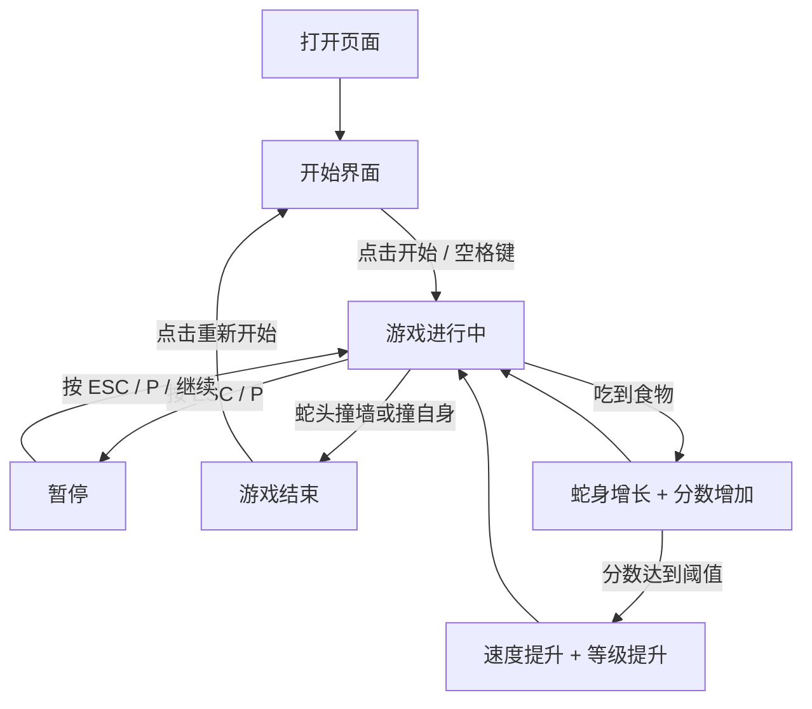

## 1. 产品概述

网页版贪吃蛇游戏——一款以霓虹赛博朋克风格打造的经典街机游戏，玩家操控光蛇在数字矩阵中穿行、吞噬能量粒子不断成长，追求最高分数。

- 面向所有喜欢休闲小游戏的用户，提供即开即玩的流畅体验
- 以视觉冲击力和操作手感为核心竞争力，让经典玩法焕发新生

## 2. 核心功能

### 2.1 功能模块

1. **游戏主页面**：游戏画布、分数面板、操作控制、游戏状态管理
2. **排行榜弹窗**：本地历史最高分记录展示

### 2.2 页面详情

| 页面名称 | 模块名称 | 功能描述 |
|----------|----------|----------|
| 游戏主页面 | 游戏画布 | Canvas 渲染蛇身、食物、网格背景，蛇身带霓虹发光拖尾效果 |
| 游戏主页面 | 分数面板 | 实时显示当前分数、最高分、当前等级 |
| 游戏主页面 | 操作控制 | 键盘方向键/WASD 控制 + 移动端虚拟方向键 |
| 游戏主页面 | 游戏状态 | 开始界面、游戏中、暂停、游戏结束四种状态切换 |
| 游戏主页面 | 速度等级 | 随分数增长自动加速，显示当前速度等级 |
| 排行榜弹窗 | 历史记录 | 展示本地存储的 Top 10 最高分记录，含日期和分数 |

## 3. 核心流程

玩家打开页面后看到霓虹风格的开始界面，点击"开始游戏"或按空格键进入游戏。蛇以恒定速度向当前方向移动，玩家通过方向键/WASD 改变蛇的行进方向。蛇头触碰到食物后蛇身增长、分数增加，同时生成新食物。当蛇头撞到墙壁或自身时游戏结束，弹出结算面板显示本局分数与最高分，可选择重新开始。

## 4. 用户界面设计

### 4.1 设计风格

- **主题**：赛博朋克霓虹街机风格，深色背景搭配荧光色高亮
- **主色**：深黑 #0a0a0f 作为底色，霓虹绿 #00ff88 为主强调色，霓虹粉 #ff0066 为次强调色
- **按钮风格**：圆角矩形，霓虹发光边框，hover 时光晕增强
- **字体**：显示字体使用 Orbitron（科技感），UI 字体使用 Rajdhani
- **布局**：居中对称布局，游戏画布为核心，左右/上下信息面板
- **图标风格**：像素风 + 霓虹描边

### 4.2 页面设计概览

| 页面名称 | 模块名称 | UI 元素 |
|----------|----------|---------|
| 游戏主页面 | 游戏画布 | 深色网格背景，蛇身霓虹绿渐变发光拖尾，食物霓虹粉脉冲动画，碰撞时闪烁特效 |
| 游戏主页面 | 分数面板 | 左上角 Orbitron 字体显示分数，右上角最高分，底部速度等级条 |
| 游戏主页面 | 开始界面 | 居中大标题"NEON SNAKE"，霓虹发光动画，闪烁的"按空格开始"提示 |
| 游戏主页面 | 游戏结束弹窗 | 半透明遮罩，居中卡片显示本局分数/最高分/等级，霓虹边框按钮 |
| 游戏主页面 | 移动端控制 | 底部半透明虚拟方向键，十字布局 |

### 4.3 响应式设计

- 桌面优先设计，游戏画布固定 600×600 逻辑尺寸
- 平板端：画布自适应缩放，保留键盘控制
- 移动端：画布全宽适配，显示虚拟方向键，触摸滑动也可控制方向

### 4.4 动效设计

- 蛇身移动：流畅的逐帧位移，头部带方向指示
- 食物：持续脉冲缩放 + 发光呼吸动画
- 吃到食物：粒子爆炸特效 + 分数弹出动画
- 游戏结束：屏幕震动 + 红色闪烁
- 背景：缓慢流动的网格线 + 随机闪烁的像素点
