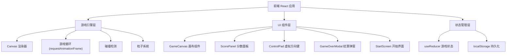

## 1. 架构设计



## 2. 技术说明

- **前端**：React 18 + Tailwind CSS 3 + Vite
- **初始化工具**：Vite (vite init)
- **后端**：无（纯前端应用）
- **数据库**：无（使用 localStorage 存储排行榜数据）
- **游戏渲染**：HTML5 Canvas 2D API
- **状态管理**：React useReducer + Context
- **动画**：requestAnimationFrame 游戏循环 + CSS 动画（UI 部分）

## 3. 路由定义

| 路由 | 用途 |
|------|------|
| / | 游戏主页面（单页应用，所有状态在同一页面切换） |

## 4. 核心模块设计

### 4.1 游戏引擎

| 模块 | 职责 |
|------|------|
| GameLoop | 基于 requestAnimationFrame 的游戏主循环，控制帧率和更新节奏 |
| SnakeController | 蛇的移动逻辑、方向控制、身体增长 |
| FoodGenerator | 食物随机生成，确保不在蛇身上 |
| CollisionDetector | 碰撞检测：墙壁碰撞、自身碰撞、食物碰撞 |
| ParticleSystem | 吃到食物时的粒子爆炸特效 |
| Renderer | Canvas 2D 渲染：网格、蛇身、食物、粒子、特效 |

### 4.2 游戏状态

```typescript
type GameState = 'idle' | 'playing' | 'paused' | 'gameover';

interface GameData {
  state: GameState;
  snake: Point[];
  direction: Direction;
  nextDirection: Direction;
  food: Point;
  score: number;
  highScore: number;
  level: number;
  speed: number;
  particles: Particle[];
}

interface Point {
  x: number;
  y: number;
}

type Direction = 'UP' | 'DOWN' | 'LEFT' | 'RIGHT';

interface Particle {
  x: number;
  y: number;
  vx: number;
  vy: number;
  life: number;
  color: string;
}

interface ScoreRecord {
  score: number;
  level: number;
  date: string;
}
```

### 4.3 游戏参数

| 参数 | 值 | 说明 |
|------|-----|------|
| GRID_SIZE | 20 | 网格数量（20×20） |
| CELL_SIZE | 30 | 每格像素大小 |
| CANVAS_SIZE | 600 | 画布逻辑尺寸 |
| BASE_SPEED | 150 | 初始移动间隔（ms） |
| SPEED_INCREMENT | 10 | 每级速度减少的毫秒数 |
| LEVEL_THRESHOLD | 5 | 每得5分升一级 |
| MAX_LEVEL | 10 | 最高等级 |
| MIN_SPEED | 60 | 最快移动间隔（ms） |

### 4.4 localStorage 数据结构

- Key: `neon_snake_high_score` — 最高分（number）
- Key: `neon_snake_leaderboard` — 排行榜 JSON 数组（ScoreRecord[]）

## 5. 组件结构

```
App
├── StartScreen          // 开始界面（标题 + 开始按钮）
├── GameContainer        // 游戏主容器
│   ├── ScorePanel       // 分数/等级/最高分面板
│   ├── GameCanvas       // Canvas 游戏画布
│   └── ControlPad       // 移动端虚拟方向键
├── GameOverModal        // 游戏结束弹窗
└── LeaderboardModal     // 排行榜弹窗
```
