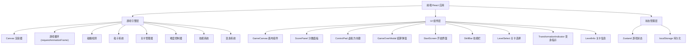
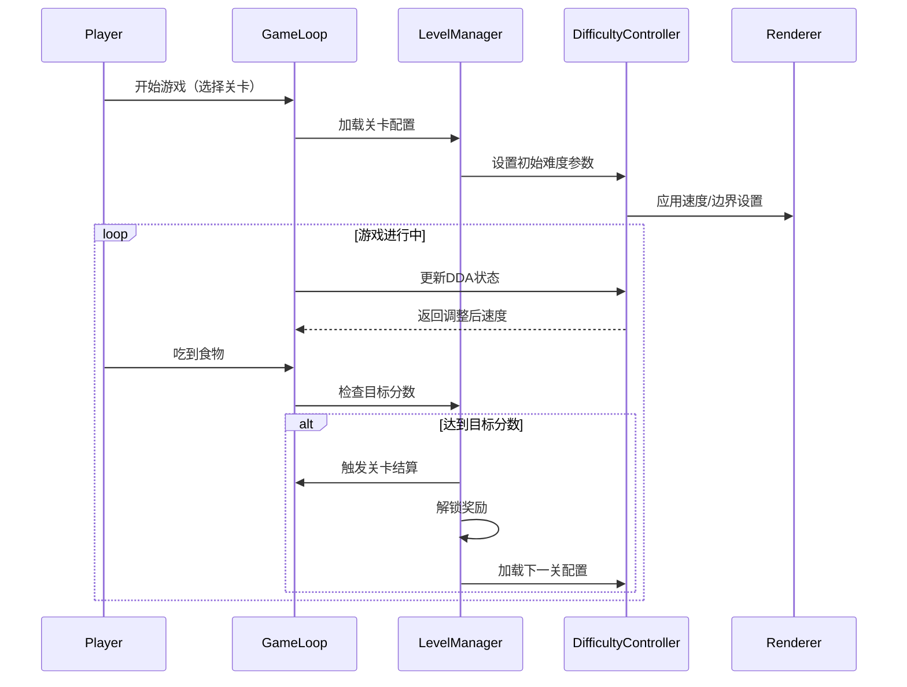
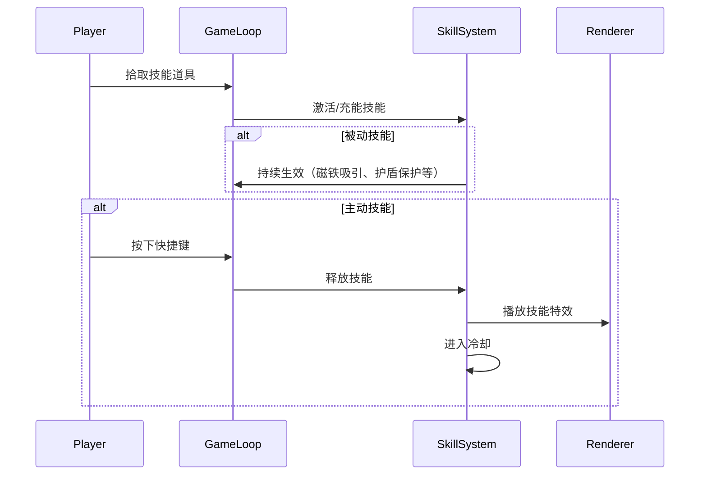
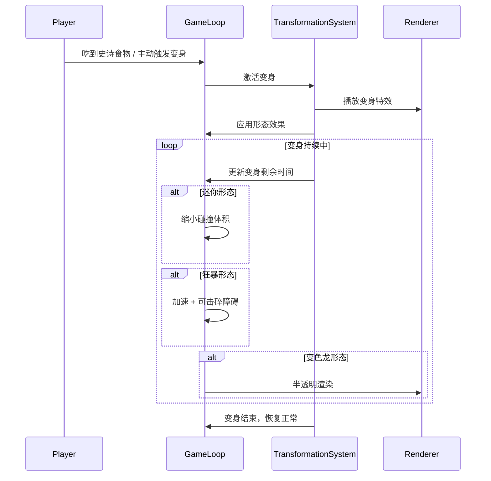

## 1. 架构设计



## 2. 技术说明

- **前端**：React 18 + Tailwind CSS 3 + Vite
- **初始化工具**：Vite (vite init)
- **后端**：无（纯前端应用）
- **数据库**：无（使用 localStorage 存储排行榜、存档、解锁数据）
- **游戏渲染**：HTML5 Canvas 2D API
- **状态管理**：Zustand
- **动画**：requestAnimationFrame 游戏循环 + CSS 动画（UI 部分）

## 3. 路由定义

| 路由 | 用途 |
|------|------|
| / | 游戏主页面（含开始界面、关卡选择、游戏进行、游戏结束） |

## 4. 核心模块设计

### 4.1 游戏引擎

| 模块 | 职责 |
|------|------|
| GameLoop | 基于 requestAnimationFrame 的游戏主循环，控制帧率和更新节奏 |
| SnakeController | 蛇的移动逻辑、方向控制、身体增长、形态变化（迷你/狂暴/变色龙） |
| FoodGenerator | 食物随机生成，支持多种食物类型（普通/奖励/超级/史诗），确保不在蛇身和障碍物上 |
| CollisionDetector | 碰撞检测：墙壁碰撞、自身碰撞、食物碰撞、障碍物碰撞、危险区域碰撞 |
| ParticleSystem | 粒子爆炸特效（吃食物、技能释放、变身触发、连击反馈） |
| Renderer | Canvas 2D 渲染：网格、蛇身、食物、粒子、障碍物、危险区域、技能特效 |
| LevelManager | 关卡配置加载、关卡切换、目标分数判定、解锁奖励发放 |
| DifficultyController | 渐进式难度调节、DDA 自适应速度、连击奖励计算、危险区域生成与消退 |
| SkillSystem | 被动技能生效逻辑、主动技能释放与充能、技能冷却管理、技能组合判定 |
| TransformationSystem | 变身形态切换、形态效果应用、变身持续时间管理、形态视觉切换 |

### 4.2 游戏状态

```typescript
type GameState = 'idle' | 'playing' | 'paused' | 'gameover' | 'levelTransition'
type Direction = 'UP' | 'DOWN' | 'LEFT' | 'RIGHT'
type FoodType = 'normal' | 'bonus' | 'super' | 'epic'
type TransformationType = 'none' | 'mini' | 'rage' | 'chameleon'
type SkillId = 'magnet' | 'shield' | 'scoreMultiplier' | 'fireball' | 'ghost' | 'magnetBurst' | 'slowField'
type LevelType = 'classic' | 'timedSurvival' | 'bounty' | 'spaceEscape' | 'challenge'

interface Point {
  x: number
  y: number
}

interface Particle {
  x: number
  y: number
  vx: number
  vy: number
  life: number
  maxLife: number
  color: string
  size: number
}

interface Food {
  position: Point
  type: FoodType
  spawnTime: number
}

interface Wall {
  position: Point
  type: 'static' | 'moving'
  direction?: Direction
  speed?: number
  range?: Point[]
}

interface DangerZone {
  position: Point
  remainingTime: number
  maxTime: number
}

interface Skill {
  id: SkillId
  type: 'passive' | 'active'
  level: number
  charge: number
  maxCharge: number
  cooldown: number
  remainingCooldown: number
  isActive: boolean
  duration: number
  remainingDuration: number
}

interface Transformation {
  type: TransformationType
  remainingTime: number
  maxTime: number
  sizeMultiplier: number
  canPassWalls: boolean
  canDestroyObstacles: boolean
  isHidden: boolean
}

interface ComboState {
  count: number
  lastEatTime: number
  multiplier: number
  timeoutMs: number
}

interface LevelConfig {
  id: number
  type: LevelType
  speed: number
  walls: Wall[]
  foodTypes: FoodType[]
  targetScore: number
  unlockReward: string
  hasDangerZone: boolean
  hasShrinkingBorder: boolean
  timeLimit?: number
}

interface LevelProgress {
  currentLevel: number
  unlockedLevels: number[]
  completedLevels: number[]
  unlockedSkins: string[]
  unlockedSkills: SkillId[]
}

interface DDAState {
  recentPerformance: number[]
  adaptiveSpeedOffset: number
  dangerZoneLifetime: number
}

interface GameData {
  state: GameState
  snake: Point[]
  direction: Direction
  nextDirection: Direction
  foods: Food[]
  score: number
  highScore: number
  level: number
  speed: number
  particles: Particle[]
  walls: Wall[]
  dangerZones: DangerZone[]
  skills: Skill[]
  transformation: Transformation
  combo: ComboState
  levelConfig: LevelConfig
  levelProgress: LevelProgress
  dda: DDAState
  shakeIntensity: number
  flashAlpha: number
}

interface ScoreRecord {
  score: number
  level: number
  date: string
}
```

### 4.3 游戏参数

| 参数 | 值 | 说明 |
|------|-----|------|
| GRID_SIZE | 20 | 网格数量（20×20） |
| CELL_SIZE | 30 | 每格像素大小 |
| CANVAS_SIZE | 600 | 画布逻辑尺寸 |
| BASE_SPEED | 150 | 初始移动间隔（ms） |
| SPEED_INCREMENT | 10 | 每级速度减少的毫秒数 |
| LEVEL_THRESHOLD | 5 | 每得5分升一级 |
| MAX_LEVEL | 10 | 最高等级 |
| MIN_SPEED | 60 | 最快移动间隔（ms） |
| COMBO_TIMEOUT | 3000 | 连击超时时间（ms） |
| COMBO_MULTIPLIER_BASE | 1.5 | 连击基础倍率 |
| DANGER_ZONE_LIFETIME | 5000 | 危险区域持续时间（ms） |
| DANGER_ZONE_SPAWN_DELAY | 300 | 蛇身经过后生成危险区域的延迟（ms） |
| TRANSFORMATION_DURATION | 8000 | 变身默认持续时间（ms） |
| SKILL_COOLDOWN_DEFAULT | 15000 | 主动技能默认冷却时间（ms） |
| GHOST_DURATION | 5000 | 幽灵形态持续时间（ms） |
| SLOW_FIELD_DURATION | 3000 | 减速领域持续时间（ms） |
| MAGNET_RANGE | 3 | 磁铁吸引范围（格数） |
| FIREBALL_COUNT | 3 | 火球发射数量 |
| FOOD_SPAWN_WEIGHTS | { normal: 70, bonus: 20, super: 8, epic: 2 } | 各类食物生成权重 |
| DDA_WINDOW | 30000 | DDA 自适应评估窗口（ms） |
| DDA_SPEED_ADJUST_RANGE | 0.1 | DDA 速度调整幅度（±10%） |

### 4.4 关卡配置数据

```typescript
const LEVEL_CONFIGS: LevelConfig[] = [
  {
    id: 1,
    type: 'classic',
    speed: 0.3,
    walls: [],
    foodTypes: ['normal', 'bonus'],
    targetScore: 80,
    unlockReward: 'skin_1',
    hasDangerZone: false,
    hasShrinkingBorder: false,
  },
  {
    id: 2,
    type: 'classic',
    speed: 0.35,
    walls: [{ position: { x: 5, y: 5 }, type: 'static' }, { position: { x: 14, y: 14 }, type: 'static' }],
    foodTypes: ['normal', 'bonus', 'super'],
    targetScore: 150,
    unlockReward: 'endless_mode',
    hasDangerZone: false,
    hasShrinkingBorder: false,
  },
  {
    id: 3,
    type: 'timedSurvival',
    speed: 0.4,
    walls: [
      { position: { x: 3, y: 3 }, type: 'static' },
      { position: { x: 16, y: 16 }, type: 'static' },
      { position: { x: 10, y: 3 }, type: 'moving', direction: 'RIGHT', speed: 0.5, rangeStart: { x: 5, y: 3 }, rangeEnd: { x: 15, y: 3 } },
    ],
    foodTypes: ['normal', 'bonus', 'super', 'epic'],
    targetScore: 300,
    unlockReward: 'skill_system',
    hasDangerZone: false,
    hasShrinkingBorder: false,
    timeLimit: 300,
  },
  {
    id: 4,
    type: 'bounty',
    speed: 0.5,
    walls: [
      { position: { x: 2, y: 2 }, type: 'static' },
      { position: { x: 17, y: 17 }, type: 'static' },
      { position: { x: 10, y: 10 }, type: 'moving', direction: 'DOWN', speed: 0.3, rangeStart: { x: 10, y: 5 }, rangeEnd: { x: 10, y: 15 } },
    ],
    foodTypes: ['normal', 'bonus', 'super', 'epic'],
    targetScore: 500,
    unlockReward: 'transformation_system',
    hasDangerZone: true,
    hasShrinkingBorder: false,
  },
  {
    id: 5,
    type: 'spaceEscape',
    speed: 0.6,
    walls: [
      { position: { x: 4, y: 4 }, type: 'static' },
      { position: { x: 15, y: 4 }, type: 'static' },
      { position: { x: 4, y: 15 }, type: 'static' },
      { position: { x: 15, y: 15 }, type: 'static' },
      { position: { x: 10, y: 8 }, type: 'moving', direction: 'RIGHT', speed: 0.4, rangeStart: { x: 6, y: 8 }, rangeEnd: { x: 14, y: 8 } },
    ],
    foodTypes: ['normal', 'bonus', 'super', 'epic'],
    targetScore: 800,
    unlockReward: 'epic_skin',
    hasDangerZone: true,
    hasShrinkingBorder: true,
  },
]
```

### 4.5 localStorage 数据结构

| Key | 类型 | 说明 |
|-----|------|------|
| `neon_snake_high_score` | number | 最高分 |
| `neon_snake_leaderboard` | ScoreRecord[] (JSON) | 排行榜 Top 10 |
| `neon_snake_level_progress` | LevelProgress (JSON) | 关卡进度、解锁状态 |
| `neon_snake_unlocked_skins` | string[] (JSON) | 已解锁皮肤列表 |
| `neon_snake_unlocked_skills` | string[] (JSON) | 已解锁技能列表 |

## 5. 组件结构

```
App
├── StartScreen              // 开始界面（标题 + 开始按钮 + 关卡选择入口）
├── LevelSelect              // 关卡选择页面（关卡卡片网格）
├── GameContainer            // 游戏主容器
│   ├── LevelInfo            // 关卡信息（关卡编号、目标分数）
│   ├── ScorePanel           // 分数/等级/最高分面板 + 关卡目标进度条
│   ├── GameCanvas           // Canvas 游戏画布
│   ├── SkillBar             // 技能栏（被动/主动技能图标 + 充能进度 + 快捷键）
│   ├── TransformationIndicator  // 变身状态指示（图标 + 倒计时环）
│   └── ControlPad           // 移动端虚拟方向键 + 技能按钮
├── GameOverModal            // 游戏结束弹窗（含关卡进度）
└── LeaderboardModal         // 排行榜弹窗
```

## 6. 系统交互流程

### 6.1 关卡切换流程



### 6.2 技能系统流程



### 6.3 变身系统流程


